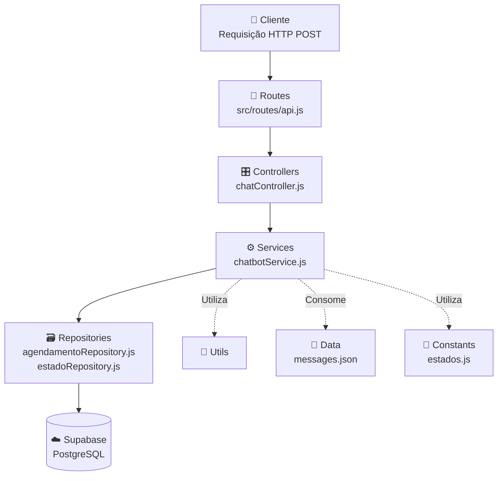
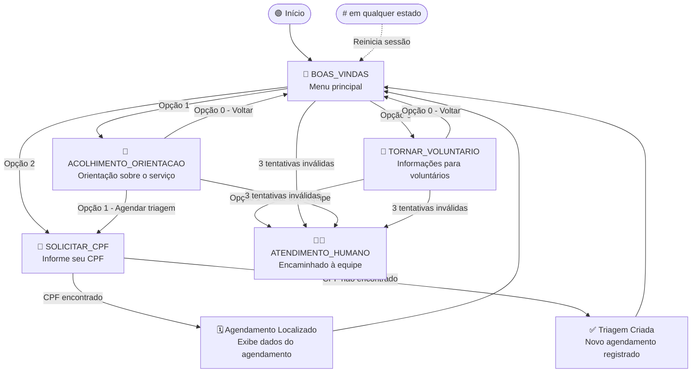
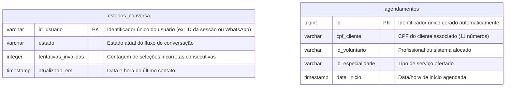

# 🤖 Chatbot de Acolhimento Social - Instituto Conecta Vida

## Backend em Node.js com Persistência de Estados no Supabase

<br />

<div align="center">
  
</div>

<br />

<div align="center">
  
  
  
  
  
  
</div>

---

<br />

## 🎯 Sobre o Projeto

Este é o repositório do backend do **Chatbot de Acolhimento Social** do **Instituto Conecta Vida**, um assistente virtual projetado para automatizar o primeiro contato e a triagem de usuários que necessitam de suporte psicológico e de assistência social.

O sistema evoluiu de um chatbot operacional para uma arquitetura backend baseada em **máquina de estados persistida**, com controle de estado persistido no banco de dados (Supabase). Isso permite gerenciar fluxos de conversação de forma contínua e integrada ao banco de dados relacional. Se o servidor for reiniciado ou a conexão for temporariamente interrompida, o chatbot recorda o contexto e o estado do usuário, garantindo a continuidade do atendimento.

> [!NOTE]
> Este projeto foi desenvolvido para fins demonstrativos e acadêmicos, integrando competências de desenvolvimento backend em Node.js com serviços em nuvem (Supabase/PostgreSQL).

---

## 🏛️ Arquitetura do Sistema

O projeto segue uma **arquitetura em camadas (Layered Architecture)**, na qual cada camada possui uma responsabilidade única e bem definida. Essa separação de responsabilidades facilita a manutenção, a testabilidade e a escalabilidade do sistema, garantindo que alterações em uma camada não impactem diretamente as demais.

O fluxo de uma requisição inicia no webhook do chatbot, passa pelo controller para validação da entrada, segue para a camada de serviços onde as regras de negócio são executadas e, quando necessário, acessa os repositórios responsáveis pela comunicação com o banco de dados. Durante esse processo, funções utilitárias são utilizadas para validações e formatações, mantendo a lógica de negócio mais organizada.



| Camada           | Diretório           | Responsabilidade                                                                           |
| :--------------- | :------------------ | :----------------------------------------------------------------------------------------- |
| **Routes**       | `src/routes/`       | Define os endpoints da API e encaminha as requisições para os controllers                  |
| **Controllers**  | `src/controllers/`  | Valida os dados da requisição e aciona a camada de serviço                                 |
| **Services**     | `src/services/`     | Contém toda a lógica de negócio e a máquina de estados do chatbot                          |
| **Repositories** | `src/repositories/` | Centraliza o acesso ao banco de dados, isolando as operações realizadas no Supabase        |
| **Utils**        | `src/utils/`        | Fornece funções auxiliares reutilizáveis (validação, formatação, higienização)             |
| **Constants**    | `src/constants/`    | Centraliza constantes utilizadas pela aplicação, como os estados da máquina de conversação |
| **Config**       | `src/config/`       | Instancia e configura o cliente de acesso ao Supabase                                      |
| **Data**         | `src/data/`         | Armazena os textos e menus do chatbot em formato estático (JSON)                           |

> [!TIP]
> **Benefícios dessa arquitetura**
>
> - Separação clara de responsabilidades
> - Facilidade para manutenção e evolução do código
> - Reutilização de funções utilitárias
> - Menor acoplamento entre as camadas
> - Código mais organizado e escalável

---

## 🔄 Fluxo do Chatbot

A máquina de estados controla o progresso de cada usuário na conversa de forma individual e persistida. O diagrama abaixo representa os estados possíveis e as transições entre eles:



Cada usuário é identificado por um `idUsuario` único. Ao receber uma mensagem, o sistema recupera o estado atual desse usuário no banco de dados e decide qual ação executar com base nesse estado sem depender de variáveis em memória. Isso garante que o contexto da conversa seja mantido mesmo que o servidor seja reiniciado ou a conexão seja interrompida.

As transições entre estados são gerenciadas por funções dedicadas dentro do `chatbotService.js`. Entradas inválidas incrementam um contador de tentativas; ao atingir três erros consecutivos em qualquer estado do fluxo, o usuário é automaticamente encaminhado para `ATENDIMENTO_HUMANO`. O comando `#` funciona como um atalho global que encerra a sessão corrente e retorna o usuário ao menu inicial (`BOAS_VINDAS`), independentemente do estado em que se encontra.

---

## 🛠️ Tecnologias Utilizadas

| Tecnologia / Biblioteca              | Função no Projeto                                                    | Versão   |
| :----------------------------------- | :------------------------------------------------------------------- | :------- |
| **Node.js**                          | Ambiente de execução JavaScript assíncrono no servidor               | v18+     |
| **Express**                          | Framework web para criação dos endpoints e middlewares da API        | ^5.2.1   |
| **Supabase (@supabase/supabase-js)** | Banco de dados relacional PostgreSQL na nuvem e persistência         | ^2.108.2 |
| **dotenv**                           | Gerenciamento seguro de variáveis de ambiente                        | ^17.4.2  |
| **cors**                             | Habilitação e controle de compartilhamento de recursos entre origens | ^2.8.6   |
| **Jest**                             | Framework de testes automatizados                                    | ^30.4.2  |
| **ESLint**                           | Linter para padronização e análise estática de código                | ^10.6.0  |
| **Prettier**                         | Formatador de código para consistência de estilo                     | ^5.5.6   |

---

## 🧠 Arquitetura e Diferenciais Técnicos

- **Persistência de Contexto (Máquina de Estados):** O estado da conversa (`BOAS_VINDAS`, `ACOLHIMENTO_ORIENTACAO`, `SOLICITAR_CPF`, `TORNAR_VOLUNTARIO`, `ATENDIMENTO_HUMANO`) é gravado em tempo real no banco de dados.
- **Validação e Tratamento de Input:** As entradas textuais de primeiro contato passam por limpeza de caracteres especiais, conversão para minúsculo e remoção de acentos via Regex, permitindo interações mais fluidas (ex: identificar "Olá", "oi", "bom dia").
- **Regras de Negócio de Triagem:**
  - Busca em tempo real de agendamentos associados a um CPF específico.
  - Cadastro automatizado (INSERT) de um novo atendimento de triagem caso o CPF não possua histórico no sistema.
- **Mecanismo de Segurança e Fallback:** Caso o usuário digite uma opção inválida por 3 vezes consecutivas, o sistema direciona automaticamente o contato para a fila de atendimento humano (`ATENDIMENTO_HUMANO`).
- **Comando de Redirecionamento Global:** O envio de `#` em qualquer etapa finaliza a sessão corrente e redefine o estado do usuário para o menu inicial.

---

## 🗄️ Estrutura do Banco de Dados

A persistência do sistema é estruturada no PostgreSQL através do Supabase em duas tabelas fundamentais:



---

## 📂 Estrutura de Pastas

```text
📦 chatbot
 ┣ 📂 assets                 # Imagens, diagramas e recursos visuais do repositório
 ┣ 📂 src                    # Código-fonte da aplicação
 ┃ ┣ 📂 config               # Módulos de conexão e configuração
 ┃ ┃ ┗ 📜 database.js        # Instanciação do cliente Supabase
 ┃ ┣ 📂 constants            # Constantes da aplicação
 ┃ ┃ ┗ 📜 estados.js          # Enum dos estados da máquina de conversação
 ┃ ┣ 📂 controllers          # Controladores que gerenciam requisições e respostas
 ┃ ┃ ┣ 📜 agendamentoController.js # Controlador para agendamentos (REST API)
 ┃ ┃ ┗ 📜 chatController.js   # Valida e encaminha as requisições recebidas pelo webhook
 ┃ ┣ 📂 data                 # Arquivos de dados estáticos
 ┃ ┃ ┗ 📜 messages.json      # Fluxo de mensagens e menus estruturados do chatbot
 ┃ ┣ 📂 repositories         # Acesso e persistência de dados no Supabase
 ┃ ┃ ┣ 📜 agendamentoRepository.js # Operações de CRUD sobre a tabela agendamentos
 ┃ ┃ ┗ 📜 estadoRepository.js  # Leitura e escrita do estado da conversa por usuário
 ┃ ┣ 📂 routes               # Definição dos roteadores da aplicação
 ┃ ┃ ┗ 📜 api.js             # Webhook do chatbot (/api/webhook) e rotas administrativas
 ┃ ┣ 📂 services             # Regras de negócio e motores lógicos
 ┃ ┃ ┗ 📜 chatbotService.js  # Lógica da máquina de estados do chatbot
 ┃ ┗ 📜 app.js               # Inicialização do servidor Express e Middlewares
 ┣ 📂 tests                  # Testes automatizados da aplicação
 ┃ ┣ 📜 chatbotService.test.js # Testes da máquina de estados
 ┃ ┗ 📜 estadoRepository.test.js # Estrutura de testes para persistência
 ┣ 📜 .env.example           # Exemplo estruturado das configurações locais
 ┣ 📜 .gitignore             # Arquivos ignorados pelo sistema de versionamento Git
 ┗ 📜 package.json           # Dependências e scripts de desenvolvimento
```

---

## ⚙️ Configuração e Instalação Local

### Pré-requisitos

- [Node.js](https://nodejs.org/) (versão 18 ou superior)
- Gerenciador de pacotes `npm`
- Conta ativa ou projeto configurado no [Supabase](https://supabase.com/)

### Passo 1: Clonar o Repositório

```bash
git clone https://github.com/jrs-neto/chatbot.git
cd chatbot
```

### Passo 2: Instalar Dependências

```bash
npm install
```

### Passo 3: Configurar Variáveis de Ambiente

Crie um arquivo `.env` na raiz do projeto baseado no `.env.example`:

Copie o arquivo `.env.example` para `.env` e preencha as variáveis de ambiente.

Abra o arquivo `.env` e preencha as variáveis de ambiente com as credenciais do seu projeto Supabase:

```env
PORT=3000
SUPABASE_URL=https://seu-projeto.supabase.co
SUPABASE_KEY=sua-chave-anon-public-supabase
```

### Passo 4: Executar a Aplicação

Inicie o servidor Express localmente em ambiente de desenvolvimento (com recarregamento automático):

```bash
npm run dev
```

O console exibirá a confirmação de que o servidor está em execução:

```text
==================================================
🤖 Chatbot Server running on: http://localhost:3000
==================================================
```

---

## 🧪 Execução de Testes Automatizados

A aplicação conta com uma suíte de testes unitários automatizados cobrindo a máquina de estados, regras de transição, contadores de tentativas inválidas e a validação de fluxos.

Os testes foram desenvolvidos utilizando o **Jest** e utilizam mocks estruturados para isolar completamente a camada de persistência.

Para executar todos os testes da aplicação:

```bash
npm test
```

Para executar os testes em tempo real (Watch Mode):

```bash
npx jest --watch
```

---

## 🚀 Como Testar o Webhook

A comunicação principal é realizada via requisições HTTP utilizando o método `POST` diretamente no endpoint de webhook do chatbot.

### Endpoint de Webhook

**Produção (Render)**
```http
POST https://chatbot-conecta-vida.onrender.com/api/webhook
```

**Desenvolvimento Local**
```http
POST http://localhost:3000/api/webhook
```

Headers:
Content-Type: application/json

#### Corpo da Requisição (JSON)

- `idUsuario` (String): Identificador único do contato (ex: número telefônico ou hash do usuário).
- `mensagem` (String): A mensagem ou opção digitada.

```json
{
  "idUsuario": "user-test-01",
  "mensagem": "Olá"
}
```

#### Retorno do Servidor (JSON)

O servidor retorna o texto formatado do menu subsequente e o respectivo estado da conversa persistido.

```json
{
  "text": "Olá! Seja bem-vindo(a) ao assistente virtual do **Instituto Conecta Vida**.\n*(Este é um projeto demonstrativo para Portfólio)*\n\nComo podemos ajudar hoje? Digite o número da opção desejada:\n\n1. Solicitar Novo Acolhimento\n2. Consultar / Gerenciar Agendamento Existente\n3. Quero ser um Voluntário\n#. Encerrar conversa",
  "estado": "BOAS_VINDAS"
}
```

---

## 🗂️ Fluxos de Demonstração (Massa de Testes)

Utilize os roteiros abaixo no seu cliente HTTP (Insomnia, Postman ou cURL) para avaliar as ramificações lógicas do webhook do chatbot:

### 1. Consulta de Agendamento Existente (Sucesso)

- Envie `"Olá"` para `idUsuario: "user-123"` para receber o menu principal.
- Envie `"2"` para acessar a consulta de agendamentos.
- Digite o CPF de teste pré-cadastrado no banco: `12345678901`
- **Retorno Esperado:** O bot localizará as informações de agendamento existentes no Supabase e exibirá os detalhes (profissional, data, hora, etc.).

### 2. Cadastro de Triagem Automática (Novo Registro)

- Envie `"Olá"` para `idUsuario: "user-456"` para receber o menu principal.
- Envie `"1"` para solicitar um novo acolhimento.
- Envie `"1"` novamente para agendar a triagem.
- Digite um CPF não registrado no sistema (ex: `98765432109`).
- **Retorno Esperado:** O sistema gerará um novo registro de triagem agendado para o dia seguinte no banco de dados e confirmará as informações ao usuário.

### 3. Mecanismo de Timeout por Tentativas

- A partir do menu principal, envie respostas inválidas sucessivas (ex: `"x"`, `"y"`, `"z"`).
- Ao alcançar a 3ª tentativa inválida consecutiva, o sistema retornará a mensagem de encaminhamento automático para a equipe humana.

---

## ☁️ Implantação (Deploy no Render)

A API e o Webhook do Chatbot estão publicados em produção e podem ser acessados publicamente:

🌐 **URL de Produção:** [https://chatbot-conecta-vida.onrender.com/](https://chatbot-conecta-vida.onrender.com/)

---

### Passos de Configuração do Web Service no Render (Hospedagem Própria)

Este projeto está estruturado para ser facilmente hospedado no **[Render](https://render.com/)** como um **Web Service**.

### Passos de Configuração do Web Service no Render

1. Crie uma conta ou faça login no painel do [Render](https://render.com/).
2. Clique em **New** > **Web Service**.
3. Conecte o seu repositório do GitHub contendo este projeto.
4. Configure as seguintes propriedades do serviço:
   - **Environment:** `Node`
   - **Build Command:** `npm install`
   - **Start Command:** `npm start`
5. Acesse a aba **Environment** e configure as seguintes variáveis de ambiente:
   - `PORT`: Porta onde o Express ouvirá (o Render injetará isso automaticamente, mas o padrão interno é configurado).
   - `SUPABASE_URL`: A URL do seu banco de dados Supabase.
   - `SUPABASE_KEY`: A chave anônima (anon key) do seu banco Supabase.
6. Clique em **Create Web Service** para iniciar a implantação.

---

## 🤝 Contribuições

Este repositório possui fins educacionais e de demonstração prática. Sugestões de melhorias ou correções de bugs podem ser enviadas por meio de **Issues** ou **Pull Requests**.

---

## ⚖️ Licença

Este projeto está licenciado sob a licença **MIT** — livre para uso educacional e profissional.

---

## 📞 Contato

Desenvolvido por [**José Rodrigues**](https://github.com/jrs-neto)  
Para dúvidas, sugestões ou colaborações, utilize as **issues do GitHub** ou entre em contato diretamente pelo perfil:

- 🔗 **GitHub:** [jrs-neto](https://github.com/jrs-neto)
- 🔗 **LinkedIn:** [jrodrigues-neto](https://www.linkedin.com/in/jrodrigues-neto/)
- 🔗 **Portfólio:** [portfolio](https://jrs-neto.github.io/portfolio/)
