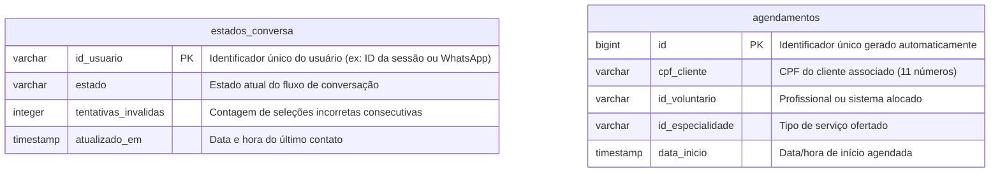

# 🤖 Chatbot de Acolhimento Social - Instituto Conecta Vida

## Backend em Node.js com Persistência de Estados no Supabase

<br />

<div align="center">
  
</div>

<br />

<div align="center">
  
  
  
  
  
  
</div>

------

<br />

## 🎯 Sobre o Projeto

Este é o repositório do backend do **Chatbot de Acolhimento Social** do **Instituto Conecta Vida**, um assistente virtual projetado para automatizar o primeiro contato e a triagem de usuários que necessitam de suporte psicológico e de assistência social. 

O sistema implementa uma **arquitetura de máquina de estados persistida**, permitindo gerenciar fluxos de conversação de forma contínua e integrada ao banco de dados relacional. Se o servidor for reiniciado ou a conexão for temporariamente interrompida, o chatbot recorda o contexto e o estado do usuário, garantindo a continuidade do atendimento.

> [!NOTE]
> Este projeto foi desenvolvido para fins demonstrativos e acadêmicos, integrando competências de desenvolvimento backend em Node.js com serviços em nuvem (Supabase/PostgreSQL).

------

## 🛠️ Tecnologias Utilizadas

| Tecnologia / Biblioteca | Função no Projeto | Versão |
| :--- | :--- | :--- |
| **Node.js** | Ambiente de execução JavaScript assíncrono no servidor | v18+ |
| **Express** | Framework web para criação dos endpoints e middlewares da API | ^5.2.1 |
| **Supabase (@supabase/supabase-js)** | Banco de dados relacional PostgreSQL na nuvem e persistência | ^2.108.2 |
| **dotenv** | Gerenciamento seguro de variáveis de ambiente | ^17.4.2 |
| **cors** | Habilitação e controle de compartilhamento de recursos entre origens | ^2.8.6 |

------

## 🧠 Arquitetura e Diferenciais Técnicos

* **Persistência de Contexto (Máquina de Estados):** O estado da conversa (`BOAS_VINDAS`, `ACOLHIMENTO_ORIENTACAO`, `SOLICITAR_CPF`, `TORNAR_VOLUNTARIO`, `ATENDIMENTO_HUMANO`) é gravado em tempo real no banco de dados.
* **Validação e Tratamento de Input:** As entradas textuais de primeiro contato passam por limpeza de caracteres especiais, conversão para minúsculo e remoção de acentos via Regex, permitindo interações mais fluidas (ex: identificar "Olá", "oi", "bom dia").
* **Regras de Negócio de Triagem:** 
  * Busca em tempo real de agendamentos associados a um CPF específico.
  * Cadastro automatizado (INSERT) de um novo atendimento de triagem caso o CPF não possua histórico no sistema.
* **Mecanismo de Segurança e Fallback:** Caso o usuário digite uma opção inválida por 3 vezes consecutivas, o sistema direciona automaticamente o contato para a fila de atendimento humano (`ATENDIMENTO_HUMANO`).
* **Comando de Redirecionamento Global:** O envio de `#` em qualquer etapa finaliza a sessão corrente e redefine o estado do usuário para o menu inicial.

------

## 🗄️ Estrutura do Banco de Dados

A persistência do sistema é estruturada no PostgreSQL através do Supabase em duas tabelas fundamentais:



------

## 📂 Estrutura de Pastas

```text
📦 chatbot
 ┣ 📂 assets                 # Imagens, diagramas e recursos visuais do repositório
 ┣ 📂 readmes                # Modelos de README utilizados como referência de estilo
 ┣ 📂 src                    # Código-fonte da aplicação
 ┃ ┣ 📂 config               # Módulos de conexão e configuração
 ┃ ┃ ┗ 📜 database.js        # Instanciação do cliente Supabase
 ┃ ┣ 📂 controllers          # Controladores que gerenciam requisições e respostas
 ┃ ┃ ┣ 📜 agendamentoController.js # Controlador para agendamentos (estrutura futura)
 ┃ ┃ ┗ 📜 chatController.js   # Validador de dados recebidos no chat
 ┃ ┣ 📂 data                 # Arquivos de dados estáticos
 ┃ ┃ ┗ 📜 messages.json      # Fluxo de mensagens e menus estruturados do chatbot
 ┃ ┣ 📂 routes               # Definição dos roteadores de API
 ┃ ┃ ┗ 📜 api.js             # Rotas direcionadas para a API (/api/*)
 ┃ ┣ 📂 services             # Regras de negócio e motores lógicos
 ┃ ┃ ┗ 📜 chatbotService.js  # Lógica da máquina de estados do chatbot
 ┃ ┗ 📜 app.js               # Inicialização do servidor Express e Middlewares
 ┣ 📜 .env                   # Credenciais e variáveis de ambiente (privado)
 ┗ 📜 package.json           # Dependências e scripts de desenvolvimento
```

------

## ⚙️ Configuração e Instalação Local

### Pré-requisitos
* [Node.js](https://nodejs.org/) (versão 18 ou superior)
* Gerenciador de pacotes `npm`
* Conta ativa ou projeto configurado no [Supabase](https://supabase.com/)

### Passo 1: Clonar o Repositório
```bash
git clone https://github.com/jrs-neto/chatbot.git
cd chatbot
```

### Passo 2: Instalar Dependências
```bash
npm install
```

### Passo 3: Configurar Variáveis de Ambiente
Crie um arquivo `.env` na raiz do projeto e preencha-o com as chaves correspondentes:
```env
PORT=3000
SUPABASE_URL=https://seu-projeto.supabase.co
SUPABASE_KEY=sua-chave-anon-public-supabase
```

### Passo 4: Executar a Aplicação
Inicie o servidor Express localmente com o comando:
```bash
npm run dev
```
O console exibirá a confirmação de que o servidor está em execução:
```text
==================================================
🤖 Chatbot Server running on: http://localhost:3000
==================================================
```

------

## 🚀 Como Testar a API

A comunicação principal é realizada via requisições HTTP utilizando o método `POST`.

### Endpoint de Interação
* **URL:** `http://localhost:3000/api/chat`
* **Método:** `POST`
* **Headers:** `Content-Type: application/json`

#### Corpo da Requisição (JSON)
* `idUsuario` (String): Identificador único do contato (ex: número telefônico ou hash do usuário).
* `mensagem` (String): A mensagem ou opção digitada.

```json
{
  "idUsuario": "user-test-01",
  "mensagem": "Olá"
}
```

#### Retorno do Servidor (JSON)
O servidor retorna o texto formatado do menu subsequente e o respectivo estado da conversa persistido.
```json
{
  "text": "Olá! Seja bem-vindo(a) ao assistente virtual do **Instituto Conecta Vida**.\n*(Este é um projeto demonstrativo para Portfólio)*\n\nComo podemos ajudar hoje? Digite o número da opção desejada:\n\n1. Solicitar Novo Acolhimento\n2. Consultar / Gerenciar Agendamento Existente\n3. Quero ser um Voluntário\n#. Encerrar conversa",
  "estado": "BOAS_VINDAS"
}
```

------

## 🗂️ Fluxos de Demonstração (Massa de Testes)

Utilize os roteiros abaixo no seu cliente HTTP (Insomnia, Postman ou cURL) para avaliar as ramificações lógicas da API:

### 1. Consulta de Agendamento Existente (Sucesso)
* Envie `"Olá"` para `idUsuario: "user-123"` para receber o menu principal.
* Envie `"2"` para acessar a consulta de agendamentos.
* Digite o CPF de teste pré-cadastrado no banco: `12345678901`
* **Retorno Esperado:** O bot localizará as informações de agendamento existentes no Supabase e exibirá os detalhes (profissional, data, hora, etc.).

### 2. Cadastro de Triagem Automática (Novo Registro)
* Envie `"Olá"` para `idUsuario: "user-456"` para receber o menu principal.
* Envie `"1"` para solicitar um novo acolhimento.
* Envie `"1"` novamente para agendar a triagem.
* Digite um CPF não registrado no sistema (ex: `98765432109`).
* **Retorno Esperado:** O sistema gerará um novo registro de triagem agendado para o dia seguinte no banco de dados e confirmará as informações ao usuário.

### 3. Mecanismo de Timeout por Tentativas
* A partir do menu principal, envie respostas inválidas sucessivas (ex: `"x"`, `"y"`, `"z"`).
* Ao alcançar a 3ª tentativa inválida consecutiva, o sistema retornará a mensagem de encaminhamento automático para a equipe humana.

------

## 🤝 Contribuições

Este repositório possui fins educacionais e de demonstração prática. Sugestões de melhorias ou correções de bugs podem ser enviadas por meio de **Issues** ou **Pull Requests**.

------

## ⚖️ Licença

Este projeto está licenciado sob a licença **MIT** — livre para uso educacional e profissional.

------

## 📞 Contato

Desenvolvido por [**José Rodrigues**](https://github.com/jrs-neto)
Para dúvidas, sugestões ou colaborações, utilize as **issues do GitHub** ou entre em contato diretamente pelo perfil:

* 🔗 **GitHub:** https://github.com/jrs-neto
* 🔗 **LinkedIn:** https://www.linkedin.com/in/jrodrigues-neto/
* 🔗 **Portfólio:** https://jrs-neto.github.io/portfolio/